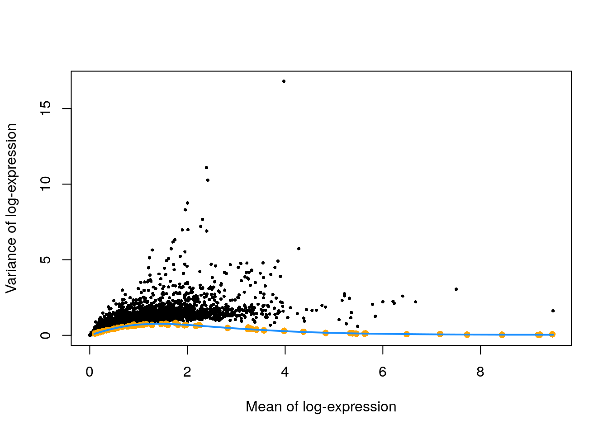

# (PART\*) DATA CLEANING {-}

# Quality control of the library

Laboratory and technical difficulties during the scRNA-seq data generation can result in poor quality libraries. Before any analysis can be run, the data itself must be checked and cleaned. If these low quality samples are not removed from the data, they can cause issues in the downstream analysis. 

## Visualizing distributions of diagnostic metrics and identifying low-quality cells

There are several common measures researchers use to determine sample quality in scRNA-seq:

  * __library size__, the total sum of counts across all relevant features (in this case, genes) for each cell. A small library size indicates the RNA has been lost at some point during the library preparation. 
 
  * __number of expressed features per cell__, the number of genes with non-zero counts. Few expressed genes suggests the transcript population was not successfully captured during the library prep.
 
  * __proportion of reads mapped to mitochondrial genes relative to total count across all features__. A high proportion suggests cytoplasmic RNA was lost from cells due to perforation of the cell membrane. These holes are large enough to let individual transcripts to escape but too small for mitochondria to escape, leading to the library being enriched for mitochondrial genes. 
 
Some experiments will use other metrics for quality control, such as RNA spike-ins (RNA transcripts of known sequence and quantity). In these experiments, researchers may choose to use proportion of spike-in reads relative to total counts as a QC (quality control) metric. This proportion should be similar across all samples, so any enrichment of the spike-in indicates a poor-quality sample. The Zeisel brain dataset does include spike-ins (s standardized control mix, labeled 'ERCC' [for the External RNA Controls Consortium, which sets standards]), so we will use this metric.

It is always a good idea to plot any metrics you're using as indicators of sample quality as the first step.


The easiest way to identify low-quality cells is to set a quality threshold and remove any samples that fail to reach it. Some researchers use fixed thresholds, although this approach requires prior knowledge and experience to know what appropriate thresholds might be. We instead can define thresholds based on deviation from the median value of each metric. This approach assumes most of the samples in a dataset are high-quality. Deviation in this case is defined as the median absolute deviation (MAD). Samples are considered outliers if any of the following are true: 

  * library size < 3 MADs from the median
  * number of expressed reads < 3 MADs from the median
  * proportion of mitochondrial reads > 3 MADs from the median
  

(If your dataset uses spike-ins, treat the proportion of spike-ins similar to the proportion of mitochondrial reads.)


```r
library(scater)

# identifying low-quality cells
stats <- perCellQCMetrics(sce.zeisel, subsets = list(Mt = rowData(sce.zeisel)$featureType == "mito"))
qc <- quickPerCellQC(stats, percent_subsets = c("altexps_ERCC_percent", 
    "subsets_Mt_percent"))

# final sample size of samples failing QC
colSums(as.matrix(qc))
```

```
##              low_lib_size            low_n_features high_altexps_ERCC_percent 
##                         0                         3                        65 
##   high_subsets_Mt_percent                   discard 
##                       128                       189
```

It would also be informative to see where the samples that failed QC (quality control) fall in the distributions of all of our quality markers.


```r
# visualizing low-quality cells in distributions
unfiltered <- sce.zeisel # we'll keep a copy of the unfiltered data, so we can see where on the distributions the eliminated samples lie
colData(unfiltered) <- cbind(colData(unfiltered), stats)
unfiltered$discard <- qc$discard # this gives us a list of the samples that have failed QC

# plotting the distributions, coloring the samples that will be removed in orange
gridExtra::grid.arrange(
    plotColData(unfiltered, y = "sum", colour_by = "discard") +
        scale_y_log10() + ggtitle("Total count"),
    plotColData(unfiltered, y = "detected", colour_by = "discard") +
        scale_y_log10() + ggtitle("Detected features"),
    plotColData(unfiltered, y = "altexps_ERCC_percent",
        colour_by = "discard") + ggtitle("ERCC percent"),
    plotColData(unfiltered, y = "subsets_Mt_percent",
        colour_by = "discard") + ggtitle("Mito percent"),
    ncol=2
)
```


## Identifying and removing low-quality cells


After you have identified the low-quality cells, you can easily remove them in R. 


```r
# creating a dataset with only the samples that pass QC
sce.zeisel.qc <- sce.zeisel[,!qc$discard]
```


::: {.reflection}
QUESTIONS

1. How many samples did you remove as suspected low-quality cells? 

2. Do all the quality metrics (total count, number of expressed features, percentage of mitochondrial reads, and percentage of ERCC reads) agree when it comes to identifying low-quality samples?

3. Which metric resulted in the removal of the greatest number of samples?
:::


::: {.dictionary}
Some researchers mark the suspected low-quality cells instead of removing them from the analysis. Ideally, the low-quality cells form their own cluster that can be ignored when interpreting the scRNA-seq results. This approach prevents the researcher from discarding cells or cell types that represent a true biological state and happen to have poor QC metrics.
:::


# Normalization

Single-cell RNA-seq libraries often vary in sequence coverage due to technical differences in cDNA capture or PCR amplification. We use normalization to correct for these differences. 

## Calculating scaling factors

The simplest approach is to use library size as a scaling factor for each cell. One assumption underlying the library size normalization method is that library size is an unbiased estimate of capture or amplification issues. While this assumption is not necessarily biologically realistic, in practice the accuracy of the normalization step is unlikely to cause issues in exploratory scRNA-seq analyses.

Sometimes unbalanced differential expression exists between samples, which results in composition biases in the dataset. Library size normalization can result in the non-differentially-expressed genes falsely appearing to be downregulated in one cell compared to another. If this sounds familiar, it's because this topic has been well-studied for bulk RNA-seq analysis. Several bulk normalization methods have been created to deal with this problem in bulk RNA-seq analyses. In order to translate these algorithms to scRNA-seq and the large number of zero and low counts, we pool counts from many cells for accurate sizing factor estimation. These estimated sizing factors are then "deconvolved" into cell-based factors. This process is called normalization by deconvolution.


```r
# AnVIL::install("scran")
library(scran)

# calculating scaling factors
set.seed(1000)
clusters <- quickCluster(sce.zeisel.qc)
sce.zeisel.qc <- computeSumFactors(sce.zeisel.qc, cluster = clusters) 

# comparing scaling factors based on library size (librarySizeFactors) and deconvolution (sizeFactors)
plot(librarySizeFactors(sce.zeisel.qc), sizeFactors(sce.zeisel.qc), pch = 16, xlab = "Library size factors", ylab = "Deconvolution factors", log = "xy")
```


::: {.reflection}
QUESTIONS

1. How do the scaling factors using library size normalization compare to the scaling factors using deconvolution normalization?
:::

## Applying scaling factors and computing normalized expression values

Once we have calculated scaling factors, we can compute normalized expression values for each sample by dividing the count for each gene by the size factor for the cell. The function we are using also log-transforms these normalized values, which will allow us to calculate log-fold changes in expression (a much more intuitive measure of differential expression!) This lets us focus on contributions from genes with strong relative differences.


```r
# computing normalized expression values
sce.zeisel.qc <- logNormCounts(sce.zeisel.qc)
```


# Choosing features for the analysis

The goal with many scRNA-seq analyses is to identify differences in gene expression across multiple cell types; in order to do this, cells are clustered together into groups based on a single similarity (or dissimilarity) value between a pair of cells. Which genes you choose to include in the calculation of the similarity metric can greatly influence your downstream analyses.

In general, you will choose to include those genes with the greatest variability in gene expression across all the samples. The underlying assumption is this increased variability is "true" biological variation as opposed to technical noise.

## Examining per-gene variation

We can calculate the per-gene variation across all samples using the variance of the log-normalized expression values you computed in the Normalization section. Because we are using a log-transformation, the total variance of a gene is partly driven by its abundance (not underlying biological heterogeneity). To correct for this relationship, we use a model that calculates the expected amount of variation for each abundance value. We then use the difference between the observed variation and the expected variation for each gene to identify highly-variable genes while controlling for cell abundance. 

The Zeisel data was generated across multiple plates, so we need to be wary of any possible batch effects that could be driving highly-variable genes. Normally we would address this by blocking. However, each plate only contained 20-40 cells, and the cell population as a whole is highly heterogeneous, making it unlikely the sampled cell types on each plate is the same (one of the assumptions of blocking on plate). Thus, we will ignore blocking for this analysis.

If you work with a dataset that does not contain spike-ins, you would use the `modelGeneVar()` command instead of `modelGeneVarWithSpikes()`.


```r
# calculating per-gene variation for each samples using the log-normalized expression value; the "ERCC" option tells the algorithm that information about technical (that is, non-biological) variation can be calculated using the data column labeled "ERCC"
dec.zeisel.qc <- modelGeneVarWithSpikes(sce.zeisel.qc, "ERCC")

# plotting the expected variance (blue curve and orange points), as well as the observed variance (black points)
plot(dec.zeisel.qc$mean, dec.zeisel.qc$total, pch = 16, cex = 0.5,
    xlab = "Mean of log-expression", ylab = "Variance of log-expression")
curfit <- metadata(dec.zeisel.qc)
points(curfit$mean, curfit$var, col = "orange", pch = 16)
curve(curfit$trend(x), col = 'dodgerblue', add = TRUE, lwd = 2)
```



The expected variance for each log-expression value is plotted in orange. Observed values (the black points) much higher than this trend line will be used for downstream analyses.

## Selecting highly variable genes

When choosing the genes for downstream analysis, you will need to balance choosing as many genes as possible (so as not to exclude important biological variation) with limiting the amount of random noise. The most straightforward approach is to simply take the top _n_ genes after ranking based on the biological component of variance. We are creating objects with the top 500, 1000, and 2000 genes, so that we can examine how our choice of _n_ impacts downstream calculations and steps.


```r
# getting the top 500, 1000, and 2000 most-variable genes
top500.hvgs <- getTopHVGs(dec.zeisel.qc, n = 500)
top1000.hvgs <- getTopHVGs(dec.zeisel.qc, n = 1000)
top2000.hvgs <- getTopHVGs(dec.zeisel.qc, n = 2000)

# look at the cut-offs
dec.zeisel.qc <- dec.zeisel.qc[order(dec.zeisel.qc$bio, decreasing = TRUE),]
dec.zeisel.qc[c(1,500,1000,2000),1:6]
```

```
## DataFrame with 4 rows and 6 columns
##            mean     total      tech       bio     p.value         FDR
##       <numeric> <numeric> <numeric> <numeric>   <numeric>   <numeric>
## Plp1    3.97379  16.80426  0.275699 16.528564 0.00000e+00 0.00000e+00
## Shfm1   2.64467   1.55363  0.534672  1.018959 5.54040e-47 2.04392e-45
## Cdc42   3.34431   1.04001  0.385442  0.654563 9.97095e-38 2.96239e-36
## Vdac2   1.81697   1.08138  0.720031  0.361348 7.90101e-05 2.55550e-04
```

In this dataframe, the `bio` column represents the excess variation in gene expression (that is, the difference between the observed and expected expression). We are looking at four different genes - the gene with the greatest excess variation, as well as the last genes included in the top 500, top 1000, and top 2000 genes.

::: {.reflection}
QUESTIONS

1. What is the range of log-fold expression changes (the excess variation) when you choose the top 500 genes? What about when you choose the top 1000 genes? The top 2000 genes? 
:::


```r
sessionInfo()
```

```
## R version 4.1.3 (2022-03-10)
## Platform: x86_64-pc-linux-gnu (64-bit)
## Running under: Ubuntu 20.04.4 LTS
## 
## Matrix products: default
## BLAS:   /usr/lib/x86_64-linux-gnu/openblas-pthread/libblas.so.3
## LAPACK: /usr/lib/x86_64-linux-gnu/openblas-pthread/liblapack.so.3
## 
## locale:
##  [1] LC_CTYPE=en_US.UTF-8       LC_NUMERIC=C              
##  [3] LC_TIME=en_US.UTF-8        LC_COLLATE=en_US.UTF-8    
##  [5] LC_MONETARY=en_US.UTF-8    LC_MESSAGES=en_US.UTF-8   
##  [7] LC_PAPER=en_US.UTF-8       LC_NAME=C                 
##  [9] LC_ADDRESS=C               LC_TELEPHONE=C            
## [11] LC_MEASUREMENT=en_US.UTF-8 LC_IDENTIFICATION=C       
## 
## attached base packages:
## [1] stats4    stats     graphics  grDevices utils     datasets  methods  
## [8] base     
## 
## other attached packages:
##  [1] scran_1.22.1                scater_1.22.0              
##  [3] ggplot2_3.3.5               scuttle_1.4.0              
##  [5] scRNAseq_2.8.0              SingleCellExperiment_1.16.0
##  [7] SummarizedExperiment_1.24.0 Biobase_2.54.0             
##  [9] GenomicRanges_1.46.1        GenomeInfoDb_1.30.1        
## [11] IRanges_2.28.0              S4Vectors_0.32.4           
## [13] BiocGenerics_0.40.0         MatrixGenerics_1.6.0       
## [15] matrixStats_0.61.0         
## 
## loaded via a namespace (and not attached):
##   [1] AnnotationHub_3.2.2           BiocFileCache_2.2.1          
##   [3] igraph_1.3.1                  lazyeval_0.2.2               
##   [5] BiocParallel_1.28.3           digest_0.6.29                
##   [7] ensembldb_2.18.4              htmltools_0.5.2              
##   [9] viridis_0.6.2                 fansi_1.0.3                  
##  [11] magrittr_2.0.3                memoise_2.0.1                
##  [13] ScaledMatrix_1.2.0            cluster_2.1.2                
##  [15] limma_3.50.3                  Biostrings_2.62.0            
##  [17] prettyunits_1.1.1             colorspace_2.0-3             
##  [19] blob_1.2.3                    rappdirs_0.3.3               
##  [21] ggrepel_0.9.1                 xfun_0.26                    
##  [23] dplyr_1.0.8                   crayon_1.5.1                 
##  [25] RCurl_1.98-1.6                jsonlite_1.8.0               
##  [27] glue_1.6.2                    gtable_0.3.0                 
##  [29] zlibbioc_1.40.0               XVector_0.34.0               
##  [31] DelayedArray_0.20.0           BiocSingular_1.10.0          
##  [33] scales_1.2.0                  edgeR_3.36.0                 
##  [35] DBI_1.1.2                     Rcpp_1.0.8.3                 
##  [37] viridisLite_0.4.0             xtable_1.8-4                 
##  [39] progress_1.2.2                dqrng_0.3.0                  
##  [41] bit_4.0.4                     rsvd_1.0.5                   
##  [43] metapod_1.2.0                 httr_1.4.2                   
##  [45] ellipsis_0.3.2                pkgconfig_2.0.3              
##  [47] XML_3.99-0.9                  farver_2.1.0                 
##  [49] sass_0.4.1                    dbplyr_2.1.1                 
##  [51] locfit_1.5-9.5                utf8_1.2.2                   
##  [53] tidyselect_1.1.2              labeling_0.4.2               
##  [55] rlang_1.0.2                   later_1.3.0                  
##  [57] AnnotationDbi_1.56.2          munsell_0.5.0                
##  [59] BiocVersion_3.14.0            tools_4.1.3                  
##  [61] cachem_1.0.6                  cli_3.2.0                    
##  [63] generics_0.1.2                RSQLite_2.2.12               
##  [65] ExperimentHub_2.2.1           evaluate_0.15                
##  [67] stringr_1.4.0                 fastmap_1.1.0                
##  [69] yaml_2.3.5                    knitr_1.33                   
##  [71] bit64_4.0.5                   purrr_0.3.4                  
##  [73] KEGGREST_1.34.0               AnnotationFilter_1.18.0      
##  [75] sparseMatrixStats_1.6.0       mime_0.12                    
##  [77] xml2_1.3.3                    biomaRt_2.50.3               
##  [79] compiler_4.1.3                beeswarm_0.4.0               
##  [81] filelock_1.0.2                curl_4.3.2                   
##  [83] png_0.1-7                     interactiveDisplayBase_1.32.0
##  [85] statmod_1.4.36                tibble_3.1.6                 
##  [87] bslib_0.3.1                   stringi_1.7.6                
##  [89] highr_0.9                     GenomicFeatures_1.46.5       
##  [91] lattice_0.20-45               bluster_1.4.0                
##  [93] ProtGenerics_1.26.0           Matrix_1.4-0                 
##  [95] vctrs_0.4.1                   pillar_1.7.0                 
##  [97] lifecycle_1.0.1               BiocManager_1.30.16          
##  [99] jquerylib_0.1.4               BiocNeighbors_1.12.0         
## [101] bitops_1.0-7                  irlba_2.3.5                  
## [103] httpuv_1.6.5                  rtracklayer_1.54.0           
## [105] R6_2.5.1                      BiocIO_1.4.0                 
## [107] bookdown_0.24                 promises_1.2.0.1             
## [109] gridExtra_2.3                 vipor_0.4.5                  
## [111] assertthat_0.2.1              rjson_0.2.21                 
## [113] withr_2.5.0                   GenomicAlignments_1.30.0     
## [115] Rsamtools_2.10.0              GenomeInfoDbData_1.2.7       
## [117] parallel_4.1.3                hms_1.1.1                    
## [119] grid_4.1.3                    beachmat_2.10.0              
## [121] rmarkdown_2.10                DelayedMatrixStats_1.16.0    
## [123] shiny_1.7.1                   ggbeeswarm_0.6.0             
## [125] restfulr_0.0.13
```
