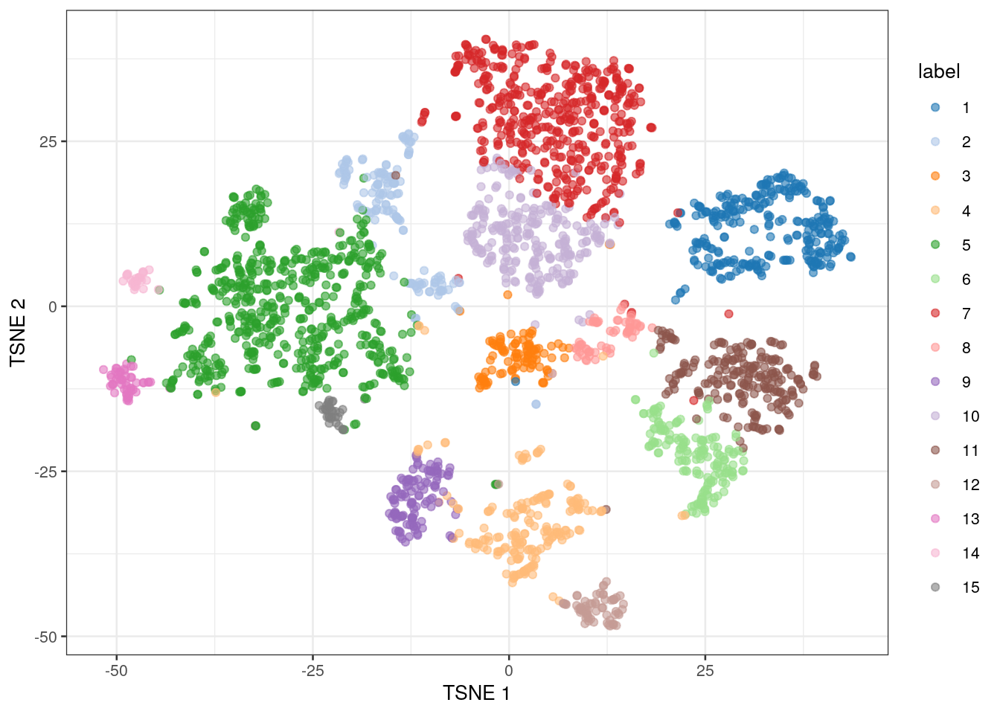

# (PART\*) CLUSTERING {-}

At this point we have a big matrix of count data for thousands of cells. In order to explore the data, we need to summarize it in a way more easily interpreted by the human brain. Generally, this involves plotting our high-dimensional data in a two dimensional space and identifying clusters of cells with similar expression profiles. 

# Dimensionality reduction

Each gene in the data represents a different dimension of the data. Reducing the number of dimensions in our data has multiple benefits, including reducing the computational work needed for downstream analyses. It also reduces the noise in the data through averaging the signal across multiple genes. 

Dimensionality reduction is a very common technique used in data science in general, not just in scRNA-seq analysis. You will find yourself using it over and over whenever you work with high-dimensional data. Dimensionality reduction is possible for genomic expression methods because so many genes have correlated expression. This is a consequence of different genes being involved in the same biological processes.
 

## Calculating and choosing PCs

We first use principal component analysis (PCA), which is a dimensionality reduction method that maximizes the amount of variation captured by each component, or PC. 

It's up to the researcher to choose how many PCs to use for downstream analyses. More PCs mean that more biological signal is retained in the data, but it also increases the potential for noise. In our analyses, we will use 50 (the default). We will also use the top 1000 genes to calculate the PCs.


```r
library(scran)

# calculating PCA
# the denoisePCA command calculates PCs and removes those that primarily capture technical noise
set.seed(101011001)
sce.zeisel.PCA.1000 <- denoisePCA(sce.zeisel.qc, technical = dec.zeisel.qc, subset.row = top1000.hvgs) #the technical option tells R where to find information about how much of the variation is attributed to "technical", or non-biological, sources

# visualizing the percentage of variation explained by each PC
percent.var <- attr(reducedDim(sce.zeisel.PCA.1000), "percentVar")
plot(percent.var, log = "y", xlab = "PC", ylab = "Variance explained (%)")
```


In PCA, the total amount of variation captured decreases for each subsequent PC. By the 10th PC, each additional PC is contributing only a small fraction to the total amount of variation explained in the dataset. Excluding them from downstream analyses has no major effect, and researchers will typically choose to include somewhere between 10 to 50 PCs. Including more PCs in the downstream analyses could theoretically cause the calculations to take longer, but in reality most calculations are fast enough that any slowdown isn't really noticeable.

More detailed information on calculating and choosing PCs for genomic analyses can be found in the [Statistics for Genomics: PCA](https://jhudatascience.org/GDSCN_Book_Statistics_for_Genomics_PCA/) book.

## Applying non-linear visualization methods to PCs

In scRNA-seq analysis, plotting PCs generally does not offer enough resolution to visualize cell clusters. Instead, we rely on additional dimensionality reduction methods that can use non-linear data transformation algorithms. The most common approach is the t-stochastic neighbor embedding (t-SNE) method (Van der Maaten and Hinton 2008). 

t-SNE maps high-dimensional data in a low-dimensional space by first calculating the Euclidean distance between each set of points, then converting those distances into the probability that given pair of points are neighbors. On t-SNE plots, points that are members of the same cluster have a high probability of being neighbors. However, you can't judge the similarity of different clusters based on their position on the final plot, because the t-SNE algorithm does not retain that information.

The t-SNE approach is computationally complex. In practice, we reduce the computational complexity in scRNA-seq analysis by performing t-SNE calculations on the top PCs in a dataset (this both decreases the amount of computational power and time needed for analysis). We also need to set an initial starting seed and the perplexity parameter (the number of effective neighbors for each point). This parameter  will determine the resolution of the plot. Lower perplexity values allow for finer resolution of population structure but can also be noisy.  It's a good idea to test multiple perplexity values when running your t-SNE analysis.

We're going to use the PCs calculated using the top 1000 highly-variable genes (a common threshold) for the rest of the analyses.


```r
library(BiocSingular)

# this code first calculates the t-SNE values using PCs, and then creates a plot of the first two t-SNE dimensions
set.seed(100)
sce.zeisel.tsne5 <- runTSNE(sce.zeisel.PCA.1000, dimred = "PCA", perplexity = 5)
out5 <- plotReducedDim(sce.zeisel.tsne5, dimred = "TSNE",
    colour_by = "level1class") + ggtitle("perplexity = 5")

set.seed(100)
sce.zeisel.tsne20 <- runTSNE(sce.zeisel.PCA.1000, dimred = "PCA", perplexity = 20)
out20 <- plotReducedDim(sce.zeisel.tsne20, dimred = "TSNE",
    colour_by = "level1class") + ggtitle("perplexity = 20")

set.seed(100)
sce.zeisel.tsne80 <- runTSNE(sce.zeisel.PCA.1000, dimred = "PCA", perplexity = 80)
out80 <- plotReducedDim(sce.zeisel.tsne80, dimred = "TSNE", 
    colour_by = "level1class") + ggtitle("perplexity = 80")

out5
```


```r
out20
```


```r
out80
```


Some researchers will use a different method for the non-linear visualization step in their analysis. This algorithm, called uniform manifold approximation and projection (UMAP), is faster and preserves more of the global data structure when reducing dimensions compared to t-SNE (that is, you get more information about the similarity of clusters, not just of points). As a result, though, the resolution within each cluster is reduced. UMAP is becoming the method of choice as scRNA-seq datasets become larger and larger.


```r
# calculate the UMAP values from the PCs, then plot the first two UMAP dimensions
set.seed(1100101001)
sce.zeisel.umap <- runUMAP(sce.zeisel.PCA.1000, dimred = "PCA")
out.umap <- plotReducedDim(sce.zeisel.umap, dimred = "UMAP", colour_by = "level1class") + ggtitle("UMAP")

out20
```


```r
out.umap
```


::: {.fyi}
QUESTIONS
1. How does changing the perplexity parameter affect the t-SNE plot?

2. How does the t-SNE plot compare to the UMAP plot?
:::

# Clustering

At its core, clustering is a tool that allows us to examine structure and patterns in our data. There isn't really a "true" answer to how the data should be clustered. Instead, we can change the algorithms and parameters to explore a variety of possibilities that work best for each dataset and question the researcher is trying to answer. 

## Clustering using graph-based methods

Graph-based clustering is based on identifying the nearest neighbors of each cell in high-dimensional space. The connections between a cell and its neighbors (called edges) are weighted based on the similarity of the two cells connected. An edge is assigned a higher weight if the two cells it connects are more closely related. After all cells have been connected to their neighbors, we apply an algorithm to identify clusters, or communities, of related cells. Each cell within a community will be more closely related to any cell within the same community than to cells outside the community.

Graph-based clustering scales easily, because it only used a _k_-nearest neighbor search. These searches run more quickly than other methods (like hierarchical clustering). Unfortunately, no information is retained about relationships beyond the neighboring cells. This effect also means that clustering resolution depends on cell density.


```r
# let the R algorithm define and label our clusters
nn.clusters <- clusterCells(sce.zeisel.tsne20, use.dimred="PCA")

# this command tells us how many clusters were identified (the top row) and how many cells belong to each cluster (the bottom row)
table(nn.clusters)
```

```
## nn.clusters
##   1   2   3   4   5   6   7   8   9  10  11  12  13  14  15 
## 284 147 107 195 604 166 475  62 119 256 221  67  53  28  32
```

We assigned the cluster assignments back into our `SingleCellExperiment` object as a factor in the column metadata, which allows us to visualize the cluster assignment on a t-SNE plot.


```r
# create a t-SNE plot showing the identified clusters
colLabels(sce.zeisel.tsne20) <- nn.clusters
plotReducedDim(sce.zeisel.tsne20, "TSNE", colour_by="label")
```




:::{.fyi}
QUESTIONS
1. How many clusters were identified using graph-based clustering? Which cluster contained the most cells, and how many cells did it have?
:::


```r
sessionInfo()
```

```
## R version 4.1.3 (2022-03-10)
## Platform: x86_64-pc-linux-gnu (64-bit)
## Running under: Ubuntu 20.04.4 LTS
## 
## Matrix products: default
## BLAS:   /usr/lib/x86_64-linux-gnu/openblas-pthread/libblas.so.3
## LAPACK: /usr/lib/x86_64-linux-gnu/openblas-pthread/liblapack.so.3
## 
## locale:
##  [1] LC_CTYPE=en_US.UTF-8       LC_NUMERIC=C              
##  [3] LC_TIME=en_US.UTF-8        LC_COLLATE=en_US.UTF-8    
##  [5] LC_MONETARY=en_US.UTF-8    LC_MESSAGES=en_US.UTF-8   
##  [7] LC_PAPER=en_US.UTF-8       LC_NAME=C                 
##  [9] LC_ADDRESS=C               LC_TELEPHONE=C            
## [11] LC_MEASUREMENT=en_US.UTF-8 LC_IDENTIFICATION=C       
## 
## attached base packages:
## [1] stats4    stats     graphics  grDevices utils     datasets  methods  
## [8] base     
## 
## other attached packages:
##  [1] uwot_0.1.11                 Matrix_1.4-0               
##  [3] BiocSingular_1.10.0         scran_1.22.1               
##  [5] scater_1.22.0               ggplot2_3.3.5              
##  [7] scuttle_1.4.0               scRNAseq_2.8.0             
##  [9] SingleCellExperiment_1.16.0 SummarizedExperiment_1.24.0
## [11] Biobase_2.54.0              GenomicRanges_1.46.1       
## [13] GenomeInfoDb_1.30.1         IRanges_2.28.0             
## [15] S4Vectors_0.32.4            BiocGenerics_0.40.0        
## [17] MatrixGenerics_1.6.0        matrixStats_0.61.0         
## 
## loaded via a namespace (and not attached):
##   [1] AnnotationHub_3.2.2           BiocFileCache_2.2.1          
##   [3] igraph_1.3.1                  lazyeval_0.2.2               
##   [5] BiocParallel_1.28.3           digest_0.6.29                
##   [7] ensembldb_2.18.4              htmltools_0.5.2              
##   [9] viridis_0.6.2                 fansi_1.0.3                  
##  [11] magrittr_2.0.3                memoise_2.0.1                
##  [13] ScaledMatrix_1.2.0            cluster_2.1.2                
##  [15] limma_3.50.3                  Biostrings_2.62.0            
##  [17] prettyunits_1.1.1             colorspace_2.0-3             
##  [19] blob_1.2.3                    rappdirs_0.3.3               
##  [21] ggrepel_0.9.1                 xfun_0.26                    
##  [23] dplyr_1.0.8                   crayon_1.5.1                 
##  [25] RCurl_1.98-1.6                jsonlite_1.8.0               
##  [27] glue_1.6.2                    gtable_0.3.0                 
##  [29] zlibbioc_1.40.0               XVector_0.34.0               
##  [31] DelayedArray_0.20.0           scales_1.2.0                 
##  [33] DBI_1.1.2                     edgeR_3.36.0                 
##  [35] Rcpp_1.0.8.3                  viridisLite_0.4.0            
##  [37] xtable_1.8-4                  progress_1.2.2               
##  [39] dqrng_0.3.0                   bit_4.0.4                    
##  [41] rsvd_1.0.5                    metapod_1.2.0                
##  [43] httr_1.4.2                    FNN_1.1.3                    
##  [45] ellipsis_0.3.2                farver_2.1.0                 
##  [47] pkgconfig_2.0.3               XML_3.99-0.9                 
##  [49] sass_0.4.1                    dbplyr_2.1.1                 
##  [51] locfit_1.5-9.5                utf8_1.2.2                   
##  [53] labeling_0.4.2                tidyselect_1.1.2             
##  [55] rlang_1.0.2                   later_1.3.0                  
##  [57] AnnotationDbi_1.56.2          munsell_0.5.0                
##  [59] BiocVersion_3.14.0            tools_4.1.3                  
##  [61] cachem_1.0.6                  cli_3.2.0                    
##  [63] generics_0.1.2                RSQLite_2.2.12               
##  [65] ExperimentHub_2.2.1           evaluate_0.15                
##  [67] stringr_1.4.0                 fastmap_1.1.0                
##  [69] yaml_2.3.5                    knitr_1.33                   
##  [71] bit64_4.0.5                   purrr_0.3.4                  
##  [73] KEGGREST_1.34.0               AnnotationFilter_1.18.0      
##  [75] sparseMatrixStats_1.6.0       mime_0.12                    
##  [77] xml2_1.3.3                    biomaRt_2.50.3               
##  [79] compiler_4.1.3                beeswarm_0.4.0               
##  [81] filelock_1.0.2                curl_4.3.2                   
##  [83] png_0.1-7                     interactiveDisplayBase_1.32.0
##  [85] statmod_1.4.36                tibble_3.1.6                 
##  [87] bslib_0.3.1                   stringi_1.7.6                
##  [89] highr_0.9                     RSpectra_0.16-0              
##  [91] GenomicFeatures_1.46.5        lattice_0.20-45              
##  [93] bluster_1.4.0                 ProtGenerics_1.26.0          
##  [95] vctrs_0.4.1                   pillar_1.7.0                 
##  [97] lifecycle_1.0.1               BiocManager_1.30.16          
##  [99] jquerylib_0.1.4               BiocNeighbors_1.12.0         
## [101] bitops_1.0-7                  irlba_2.3.5                  
## [103] httpuv_1.6.5                  rtracklayer_1.54.0           
## [105] R6_2.5.1                      BiocIO_1.4.0                 
## [107] bookdown_0.24                 promises_1.2.0.1             
## [109] gridExtra_2.3                 vipor_0.4.5                  
## [111] assertthat_0.2.1              rjson_0.2.21                 
## [113] withr_2.5.0                   GenomicAlignments_1.30.0     
## [115] Rsamtools_2.10.0              GenomeInfoDbData_1.2.7       
## [117] parallel_4.1.3                hms_1.1.1                    
## [119] grid_4.1.3                    beachmat_2.10.0              
## [121] rmarkdown_2.10                DelayedMatrixStats_1.16.0    
## [123] Rtsne_0.16                    shiny_1.7.1                  
## [125] ggbeeswarm_0.6.0              restfulr_0.0.13
```
