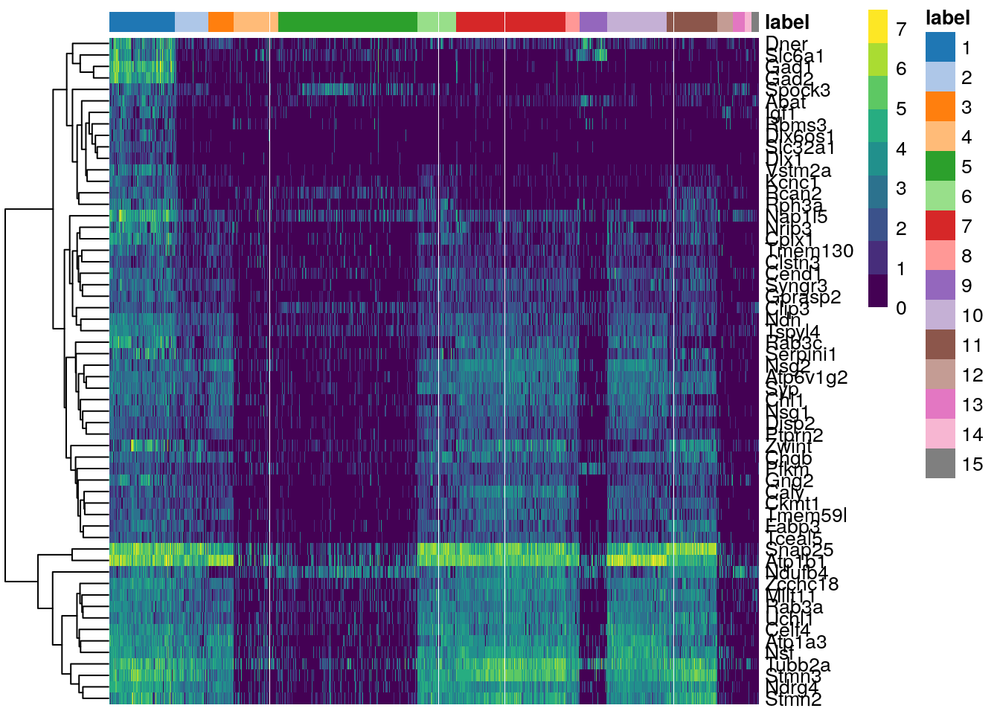

# (PART\*) ANNOTATION {-}

# Marker gene detection

We have managed to identify clusters of related cells in the data. However, these clusters aren't very useful until we can identify the biology meaning of each group. This is where functional annotation comes in.

The real art, and the greatest challenge, in an scRNA-seq analysis comes when interpreting the results. Up to this point (cleaning and clustering the data), the analysis and computation has been straightforward. Figuring out the biological state that each cluster represents, on the other hand, is more difficult, as it requires applying prior biological knowledge to the dataset. 

Thanks to previous research, we know many _marker genes_, or genes can be used to identify particular cell types. These genes are differentially expressed across cell types, and by examining the expression profiles of multiple marker genes across all the clusters, we can assign particular cell type identities to each cluster. 

## Calculating and ranking effect size summary statistics

We begin by comparing each pair of clusters and calculating scores for expression differences between the two for each gene. We have multiple options for the statistics used to compare expression values.


  * **AUC** (area under the curve) is the probability that a randomly chosen observation from cluster A is greater than a randomly chosen observation from cluster B. This statistic is a way to quantify how well we can distinguish between two distributions (clusters) in a pairwise comparison. An AUC of 1 means all values in cluster A are greater than any value from cluster B and suggests upregulation. An AUC of of 0.5 means the two clusters are indistinguishable from each other, while an AUC of 0 suggests the marker gene observations in cluster A are downregulated compared to those in cluster B. 
  
  * **Cohen's _d_** is a standardized log-fold change, and can be thought of as the number of standard deviations that separate the two groups. Positive values of Cohen's _d_ suggest that our cluster of interest (cluster A) are upregulated compared to cluster B, while negative values suggest the marker gene observations in cluster A are downregulated compared to cluster B.
  
  * **log-fold change (logFC)** is a measure of whether there is a difference in expression between clusters. Keep in mind that these values ignore the magnitude of the change. As with the others, positive values indicate upregulation in the cluster of interest (cluster A), while negative values indicate downregulation.

For each of these statistics, `scoreMarkers` calculates mean, median, minimum value (min), maximum value (max), and minimum rank (rank; the smallest rank of each gene across all pairwise comparisons). For most of these measures, a larger number indicates upregulation. For minimum rank, however, a small value means the gene is one of the top upregulated genes.

AUC or Cohen’s _d_ are effective regardless of the magnitude of the expression values and thus are good choices for general marker detection. The log-fold change in the detected proportion is specifically useful for identifying binary changes in expression.

For this exercise, we're going to focus on upregulated markers, since those are particularly useful for identifying cell types in a heterogeneous population like the Zeisel dataset. We use the `findMarkers` command, which quickly identifies potential marker genes.


```r
# identify those genes which are upregulated in some clusters compared to others
markers <- findMarkers(sce.zeisel.tsne20, direction = "up")
marker.set <- markers[["1"]]
head(marker.set, 10)
```

```
## DataFrame with 10 rows and 18 columns
##               Top      p.value          FDR summary.logFC   logFC.2   logFC.3
##         <integer>    <numeric>    <numeric>     <numeric> <numeric> <numeric>
## Syngr3          1 5.71433e-140 1.90535e-137       2.44603  1.156187 1.1330628
## Mllt11          1 3.31857e-249 7.37681e-246       2.87647  0.971725 1.4504728
## Ndrg4           1  0.00000e+00  0.00000e+00       3.83936  1.146289 0.9309904
## Slc6a1          1 1.75709e-160 8.57373e-158       3.46313  3.063161 3.2821288
## Gad1            1 4.70797e-234 8.56251e-231       4.54282  4.024699 4.3901265
## Gad2            1 1.32400e-208 1.76586e-205       4.24931  3.756435 3.9505814
## Atp1a3          1 3.54623e-279 1.41892e-275       3.45285  1.213985 0.0213418
## Slc32a1         2 1.50335e-109 2.48562e-107       1.91750  1.791641 1.8496954
## Rcan2           2 9.25451e-129 2.50197e-126       2.21812  1.432185 2.1127708
## Rab3a           2 1.61475e-202 1.61523e-199       2.52266  0.884615 0.6329209
##           logFC.4   logFC.5   logFC.6   logFC.7   logFC.8   logFC.9  logFC.10
##         <numeric> <numeric> <numeric> <numeric> <numeric> <numeric> <numeric>
## Syngr3    2.38928   2.44603 0.7085503 0.8470822  1.159959  2.525116  1.030908
## Mllt11    2.94289   2.87647 0.4897958 0.0882716  1.030983  3.262597  0.471414
## Ndrg4     3.67150   3.83936 0.3680955 0.7169171  1.103046  3.646328  0.791827
## Slc6a1    2.92969   2.88778 3.6063318 3.5292982  2.218826  0.704948  3.571574
## Gad1      4.37025   4.46268 4.6478826 4.5428243  4.477666  4.386587  4.572889
## Gad2      4.08621   4.15971 4.2916168 4.2222656  4.229715  4.207704  4.249309
## Atp1a3    3.18678   3.45285 0.6498389 0.1656598  0.426762  3.436859 -0.228370
## Slc32a1   1.93798   1.91658 1.9393715 1.9092434  1.913338  1.917505  1.910826
## Rcan2     1.81884   1.25488 1.1051970 2.1730716  2.170402  2.102633  2.218119
## Rab3a     2.73747   2.52266 0.0267138 0.3133349  0.695216  2.921335  0.163635
##          logFC.11  logFC.12  logFC.13  logFC.14  logFC.15
##         <numeric> <numeric> <numeric> <numeric> <numeric>
## Syngr3   0.684417   2.56482   2.55195   2.58830   2.42180
## Mllt11   0.229326   3.04261   2.77725   3.08889   2.01497
## Ndrg4    0.565654   3.82140   4.14743   3.97144   4.01655
## Slc6a1   3.463131   3.43495   3.34170   3.05042   3.25178
## Gad1     4.568481   4.51547   4.50591   4.39482   4.63836
## Gad2     4.263975   4.16831   4.29808   4.09088   4.35014
## Atp1a3   1.118434   3.31854   3.78426   3.67087   3.60817
## Slc32a1  1.916869   1.94707   1.94707   1.94707   1.90680
## Rcan2    1.142480   2.09515   1.26318   1.46319   2.24552
## Rab3a    0.508261   3.16930   2.54753   3.06401   2.30063
```

This dataframe shows us the in log-fold expression change for each potential marker gene between cluster 1 and every other cluster.

## Comparing gene expression levels across clusters

Once we've identified potential marker genes, we can use a heatmap to compare gene expression in each cell between clusters. 


```r
# pull the top-most upregulated markers from cluster 1 (compared to the rest of the clusters) and look at their expression in all clusters
top.markers <- rownames(marker.set)[marker.set$Top <= 10]
plotHeatmap(sce.zeisel.tsne20, features = top.markers, order_columns_by = "label")
```



In this heatmap, clusters are on the horizontal, while the top upregulated genes in cluster 1 are on the vertical. The magnitude of the log-fold expression change is indicated by color of each cell. 

We can also create a heatmap that shows the mean log-fold change of cluster 1 cells compared to the mean of each other cluster. This can simplify the heatmap and is useful when dealing with many clusters.


```r
# AnVIL::install("pheatmap")
library(pheatmap)

#this heatmap lets us compare the average expression of the gene within a cluster compared to the other clusters
logFCs <- getMarkerEffects(marker.set[1:50,])
pheatmap(logFCs, breaks = seq(-5, 5, length.out = 101))
```


Here we see that three genes are generally upregulated in Cluster 1 compared to the other clusters: _Gad1_, _Gad2_, and _Slc6a1_. This is where prior biological knowledge comes in handy, as both _Gad1_ and _Slc6a1_ are known interneuron markers (Zeng et al. 2012).

::: {.reflection}
QUESTION
1. Are there any groups or patterns you see in the second heatmap that look interesting?
:::

# Cell type annotation

Unless you are already an expert in neuronal cell expression, you probably didn't know _Gad1_ and _Slc6a1_ are known interneuron markers until you were told. Luckily, we have several high-quality references databases that can be used for annotating scRNA-seq datasets. Some of these references are useful for identifying cell types (the Zeisel dataset we have been using is a well-known reference for identifying neuronal cell types). Others, such as the Gene Ontology (GO) or Kyoto Encyclopedia of Genes and Genomes (KEGG) collections, are useful for identifying biological processes associated with each cluster.

## Annotating cell types

There are three basic strategies for annotating datasets: match the expression profile of each individual cell to the expression profile of cells from a reference dataset (the reference dataset approach); identify sets of marker genes highly expressed in each cell and match to gene sets from known cell types (the gene set approach); or perform a gene-set enrichment analysis on the marker genes that define each cluster. 

The Zeisel dataset we have been working with has actually been annotated all this time.


```r
# calculate the top marker genes assigned to each cell type (level1class) in the Zeisel dataset
wilcox.z <- pairwiseWilcox(sce.zeisel.qc, sce.zeisel.qc$level1class, 
    lfc = 1, direction = "up")
markers.z <- getTopMarkers(wilcox.z$statistics, wilcox.z$pairs,
    pairwise = FALSE, n = 50)

# look at how many cell-type categories there are, as well as how many cells assigned to each category
lengths(markers.z)
```

```
## astrocytes_ependymal    endothelial-mural         interneurons 
##                   78                   83                  119 
##            microglia     oligodendrocytes        pyramidal CA1 
##                   69                   80                  124 
##         pyramidal SS 
##                  147
```

This dataset has grouped the individual cells into 7 different categories of neuronal subtypes. We can use the gene sets that define these categories to annotate a second brain scRNA-seq dataset from Tasic et al. (2016). (We will not go through all the data cleaning and clustering steps for this new dataset - having made it this far, we trust you can do that!)


```r
#load the new dataset
sce.tasic <- TasicBrainData()
```

We first create the gene set lists using the `GSEABase` package. The `AUCell` package identifies and ranks marker sets highly expressed in each cell using an area under the curve (AUC) approach. We can assign cell type identity in the Tasic dataset by taking the marker set with the highest AUC as the label for the cell.


```r
# AnVIL::install("GSEABase")
library(GSEABase)

#create a dataset that contains just the information about the Zeisel cell-type categories and the marker genes that define each cell-type
all.sets <- lapply(names(markers.z), function(x) {
    GeneSet(markers.z[[x]], setName = x)        
})
all.sets <- GeneSetCollection(all.sets)

# AnVIL::install("AUCell")
library(AUCell)

# rank genes by expression values within each cell
rankings <- AUCell_buildRankings(counts(sce.tasic),
    plotStats = FALSE, verbose = FALSE)

# calculate AUC for each previously-defined marker set (from Zeisel) in the Tasic data
cell.aucs <- AUCell_calcAUC(all.sets, rankings)
results <- t(assay(cell.aucs))
```

After assigning cell type identities to each cluster, a researcher should always verify that the identities make sense. Since the Tasic dataset has also been annotated, we can compare our annotation to the researcher-provided annotation as a sort of sanity check.


```r
# assign cell type identity in the Tasic dataset by assumig the marker set with the top AUC is the proper label
new.labels <- colnames(results)[max.col(results)]

# compare our annotations to the annotations provided by the Tasic dataset
tab <- table(new.labels, sce.tasic$broad_type)
tab
```

```
##                       
## new.labels             Astrocyte Endothelial Cell GABA-ergic Neuron
##   astrocytes_ependymal        43                2                 0
##   endothelial-mural            0               27                 0
##   interneurons                 0                0               759
##   microglia                    0                0                 0
##   oligodendrocytes             0                0                 1
##   pyramidal SS                 0                0                 1
##                       
## new.labels             Glutamatergic Neuron Microglia Oligodendrocyte
##   astrocytes_ependymal                    0         0               0
##   endothelial-mural                       0         0               0
##   interneurons                            2         0               0
##   microglia                               0        22               0
##   oligodendrocytes                        0         0              38
##   pyramidal SS                          810         0               0
##                       
## new.labels             Oligodendrocyte Precursor Cell Unclassified
##   astrocytes_ependymal                             19            4
##   endothelial-mural                                 0            2
##   interneurons                                      0           15
##   microglia                                         0            1
##   oligodendrocytes                                  3            0
##   pyramidal SS                                      0           60
```

As you can see, the labels applied by the researchers and by our annotation mostly match. (Pyramidal SS nerves are primarily glutamatergic, so although the categories are labeled differently, those two categories do indeed match!) The major exception is the oligodendrocyte precursor cells, which our annotation called astrocytes. However, this mismatch isn't as concerning as you might think, once you know that both astrocytes and oligodendrocytes come from the same precursor cell lineage.

::: {.reflection}
QUESTION
1. Should we be concerned when 1 or 2 cells are assigned a different cell type identity by our annotation than by the researchers? Why or why not?
:::


```r
sessionInfo()
```

```
## R version 4.1.3 (2022-03-10)
## Platform: x86_64-pc-linux-gnu (64-bit)
## Running under: Ubuntu 20.04.5 LTS
## 
## Matrix products: default
## BLAS:   /usr/lib/x86_64-linux-gnu/openblas-pthread/libblas.so.3
## LAPACK: /usr/lib/x86_64-linux-gnu/openblas-pthread/liblapack.so.3
## 
## locale:
##  [1] LC_CTYPE=en_US.UTF-8       LC_NUMERIC=C              
##  [3] LC_TIME=en_US.UTF-8        LC_COLLATE=en_US.UTF-8    
##  [5] LC_MONETARY=en_US.UTF-8    LC_MESSAGES=en_US.UTF-8   
##  [7] LC_PAPER=en_US.UTF-8       LC_NAME=C                 
##  [9] LC_ADDRESS=C               LC_TELEPHONE=C            
## [11] LC_MEASUREMENT=en_US.UTF-8 LC_IDENTIFICATION=C       
## 
## attached base packages:
## [1] stats4    stats     graphics  grDevices utils     datasets  methods  
## [8] base     
## 
## other attached packages:
##  [1] AUCell_1.16.0               GSEABase_1.56.0            
##  [3] graph_1.72.0                annotate_1.72.0            
##  [5] XML_3.99-0.9                AnnotationDbi_1.56.2       
##  [7] pheatmap_1.0.12             BiocSingular_1.10.0        
##  [9] scran_1.22.1                scater_1.22.0              
## [11] ggplot2_3.3.5               scuttle_1.4.0              
## [13] scRNAseq_2.8.0              SingleCellExperiment_1.16.0
## [15] SummarizedExperiment_1.24.0 Biobase_2.54.0             
## [17] GenomicRanges_1.46.1        GenomeInfoDb_1.30.1        
## [19] IRanges_2.28.0              S4Vectors_0.32.4           
## [21] BiocGenerics_0.40.0         MatrixGenerics_1.6.0       
## [23] matrixStats_0.61.0         
## 
## loaded via a namespace (and not attached):
##   [1] AnnotationHub_3.2.2           BiocFileCache_2.2.1          
##   [3] igraph_1.3.1                  lazyeval_0.2.2               
##   [5] BiocParallel_1.28.3           digest_0.6.29                
##   [7] ensembldb_2.18.4              htmltools_0.5.2              
##   [9] viridis_0.6.2                 fansi_1.0.3                  
##  [11] magrittr_2.0.3                memoise_2.0.1                
##  [13] ScaledMatrix_1.2.0            cluster_2.1.2                
##  [15] limma_3.50.3                  Biostrings_2.62.0            
##  [17] R.utils_2.12.2                prettyunits_1.1.1            
##  [19] colorspace_2.0-3              blob_1.2.3                   
##  [21] rappdirs_0.3.3                ggrepel_0.9.1                
##  [23] xfun_0.26                     dplyr_1.0.8                  
##  [25] crayon_1.5.1                  RCurl_1.98-1.6               
##  [27] jsonlite_1.8.0                glue_1.6.2                   
##  [29] gtable_0.3.0                  zlibbioc_1.40.0              
##  [31] XVector_0.34.0                DelayedArray_0.20.0          
##  [33] scales_1.2.1                  DBI_1.1.2                    
##  [35] edgeR_3.36.0                  Rcpp_1.0.8.3                 
##  [37] viridisLite_0.4.0             xtable_1.8-4                 
##  [39] progress_1.2.2                dqrng_0.3.0                  
##  [41] bit_4.0.4                     rsvd_1.0.5                   
##  [43] metapod_1.2.0                 httr_1.4.2                   
##  [45] RColorBrewer_1.1-3            ellipsis_0.3.2               
##  [47] R.methodsS3_1.8.1             farver_2.1.0                 
##  [49] pkgconfig_2.0.3               sass_0.4.1                   
##  [51] dbplyr_2.1.1                  locfit_1.5-9.5               
##  [53] utf8_1.2.2                    tidyselect_1.1.2             
##  [55] rlang_1.0.2                   later_1.3.0                  
##  [57] munsell_0.5.0                 BiocVersion_3.14.0           
##  [59] tools_4.1.3                   cachem_1.0.6                 
##  [61] cli_3.2.0                     generics_0.1.2               
##  [63] RSQLite_2.2.12                ExperimentHub_2.2.1          
##  [65] evaluate_0.15                 stringr_1.4.0                
##  [67] fastmap_1.1.0                 yaml_2.3.5                   
##  [69] knitr_1.33                    bit64_4.0.5                  
##  [71] purrr_0.3.4                   KEGGREST_1.34.0              
##  [73] AnnotationFilter_1.18.0       sparseMatrixStats_1.6.0      
##  [75] mime_0.12                     R.oo_1.24.0                  
##  [77] xml2_1.3.3                    biomaRt_2.50.3               
##  [79] compiler_4.1.3                beeswarm_0.4.0               
##  [81] filelock_1.0.2                curl_4.3.2                   
##  [83] png_0.1-7                     interactiveDisplayBase_1.32.0
##  [85] statmod_1.4.36                tibble_3.1.6                 
##  [87] bslib_0.3.1                   stringi_1.7.6                
##  [89] highr_0.9                     GenomicFeatures_1.46.5       
##  [91] lattice_0.20-45               bluster_1.4.0                
##  [93] ProtGenerics_1.26.0           Matrix_1.4-0                 
##  [95] vctrs_0.4.1                   pillar_1.7.0                 
##  [97] lifecycle_1.0.1               BiocManager_1.30.16          
##  [99] jquerylib_0.1.4               BiocNeighbors_1.12.0         
## [101] data.table_1.14.2             bitops_1.0-7                 
## [103] irlba_2.3.5                   httpuv_1.6.5                 
## [105] rtracklayer_1.54.0            R6_2.5.1                     
## [107] BiocIO_1.4.0                  bookdown_0.24                
## [109] promises_1.2.0.1              gridExtra_2.3                
## [111] vipor_0.4.5                   assertthat_0.2.1             
## [113] rjson_0.2.21                  withr_2.5.0                  
## [115] GenomicAlignments_1.30.0      Rsamtools_2.10.0             
## [117] GenomeInfoDbData_1.2.7        parallel_4.1.3               
## [119] hms_1.1.1                     grid_4.1.3                   
## [121] beachmat_2.10.0               rmarkdown_2.10               
## [123] DelayedMatrixStats_1.16.0     Rtsne_0.16                   
## [125] shiny_1.7.1                   ggbeeswarm_0.6.0             
## [127] restfulr_0.0.13
```
